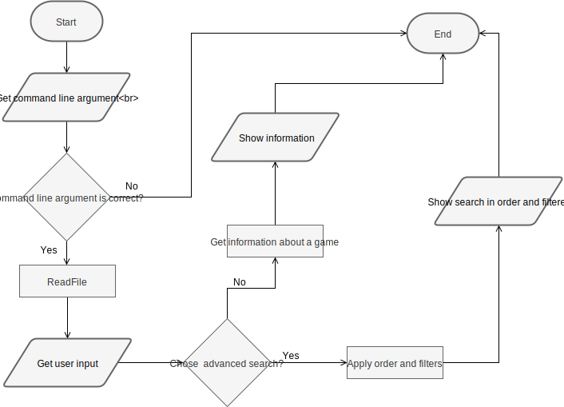

# 1º Projeto de Linguagens de Programação II

###### Projeto realizado por:
Joana Marques a21701929 <p>
Pedro Santos a21702907

##### Link do repositório GitHub : https://github.com/pedrosantosobral/LP2_Projeto1

### Relatório:
Pedro: <p>
- Criou as classes: Render, ReadFile e Filters; <p>
- Criou os menus da interface do programa; <p>
- Fez o código inicial dos filtros para os boleanos; <p>
- No Render adicionou os ciclos infinitos nos menus para corrigir erros relativos a recursividade; <p> 
- Fez as verificações para o url e data; <p>
- Fez o diagrama UML. <p>

Joana: <p>
- Criou as classes Program e Game; <p>
- No Render fez o filter manager e a sua UI; <p>
- Fez o código para mostrar a informação do jogo no primeiro menu do Render; <p>
- Fez os Lambdas para colocar os filtros na pesquisa avançada, corrigindo código anterior; <p>
- Fez o método sort para ordenar a informação; <p>
- Fez o fluxograma. <p>

O relatório foi feito por todos os elementos do grupo.

### Solução:
##### Arquitetura:
Separámos o código em várias classes.
Cada classe desepenha uma determinada função no código. <p>
O `Program` inicializa o programa. <p>
A classe `Game` tem as variávies retiradas do ficheiro, as conversões dos tipos, o método para 
imprimir os valores e o método para fazer o download da imagem. <p>
A classe `ReadFile`  serve para ler o ficheiro e colocar a informação num `Hashset<T>` e depois numa `List<T>`. <p>
A classe `Render` serve para imprimir todos os menus (interface do programa), tem o código para 
mostrar a informação de um jogo e aplica os filtros e o sort. <p>
A classe `Filters` tem o código para realizar os filtros e o sort do programa. <p>

As coleções que utilizámos no nosso código foram `HashSet` e  `List` porque as achámos adequadas visto que
teriamos de ler o ficheiro e depois guardar uma lista da sua irformação. Estas coleções permitiram-nos guardar informação
e ainda fazer o sort para uma parte do programa.<p>

Um dos algoritmos que usámos foi para ler o ficheiro e colocá-lo no `Hashset` e na `List`

```cs
public ReadFile(string path)
{
gamesFile = File.ReadAllLines(path);
allGames = HashSetAllGames(gamesFile);
searchList = allGames.ToList<Game>();
}

//method that creates a Hashset list and recives a game object
public HashSet<Game> HashSetAllGames(string[] game)
{
//temporary hashset to manage game objects
HashSet<Game> hashTemp = new HashSet<Game>();

//go throught a game object
for (int i = 1; i < game.Length; i++)
{
//split the fields by comas
Game g = new Game(game[i].Split(','));

//add the game object to the temporary hashset
if (!hashTemp.Contains(g))
{
hashTemp.Add(g);
}
}
//return the temporary hashset
return hashTemp;
}
```

##### Diagrama UML:

##### Fluxograma:


### Conclusões
Com este projeto melhorámos os nossos conhecimentos à cerca das coleções de c# e da nova matéria dos lambdas.
Achamos que os filtros de pesquisa e o sort foi o mais difícil de fazer, no entanto, depois de percebermos
como é que os `Lambdas` funcionavam, conseguimos otimizar o nosso trabalho.

### Referências
* Discussão sobre o projeto com alguns colegas de turma.
* [Lambdas](hhttps://docs.microsoft.com/en-us/dotnet/csharp/programming-guide/statements-expressions-operators/lambda-expressions)
